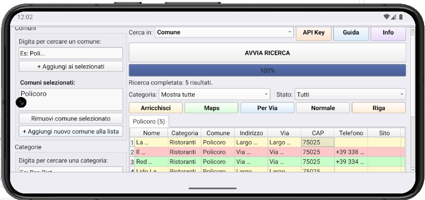

# GMExtractions — Android

Versione Android di **GMExtractions**, software per estrarre attività commerciali (bar, ristoranti, alberghi) da comuni italiani tramite le API di **Geoapify**.

---

  

## 📱 Cos'è

GMExtractions interroga le API Geoapify per estrarre attività commerciali da un'area geografica (comune, provincia o regione) filtrate per categoria. I risultati sono salvati in un database SQLite locale e visualizzati in una tabella con la possibilità di:

- Marcare ogni attività come **Da visitare / Visitato / Scartato**
- Aggiungere **note personali** e **data di visita**
- Arricchire i dati scaricando il sito web per cercare **email, Instagram, Facebook**
- Aprire la posizione su **Google Maps**
- **Esportare** i risultati in Excel, PDF o CSV

---

## ✨ Funzionalità

| Funzione | Descrizione |
|---|---|
| Ricerca per comune | Estrae attività da un singolo comune |
| Ricerca per provincia | Estrae attività da tutti i comuni di una provincia |
| Ricerca per regione | Estrae attività da tutti i comuni di una regione |
| 56 categorie | Bar, ristoranti, alberghi, negozi, farmacie, ecc. |
| 8121 comuni italiani | Database integrato |
| Stato attività | Da visitare / Visitato / Scartato (con colori) |
| Note personali | Modificabili con doppio tap o menu riga |
| Arricchimento contatti | Email, Instagram, Facebook dal sito web |
| Esportazione | Excel (.xls), PDF, CSV |
| Google Maps | Apertura posizione con un tap |
| Database SQLite | Storico persistente tra le sessioni |
| Vista tabella ottimizzata | Fino a migliaia di righe per scheda senza crash (QTableView) |

---

## 📲 Installazione

### Requisiti
- Android 8.0 (API 26) o superiore
- Architettura **arm64-v8a** (tutti i telefoni moderni)

### Download

Scarica l'APK dall'ultima release:
➡️ [**Releases**](../../releases/latest)

Scegli il file corretto:
- `GMExtractions-1.0.1-arm64.apk` → **telefono Android**
- `GMExtractions-1.0.1-x86_64.apk` → solo emulatore sul PC

### Installazione
1. Copia l'APK sul telefono
2. Apri il file con il File Manager
3. Consenti "Installa da fonti sconosciute"
4. Installa

---

## 🔑 Ottenere la API Key (gratuita)

1. Vai su [https://www.geoapify.com/](https://www.geoapify.com/)
2. Clicca **Sign up** (nessuna carta di credito)
3. Conferma l'email
4. Vai su [https://myprojects.geoapify.com/](https://myprojects.geoapify.com/)
5. Crea un progetto, copia la chiave dalla sezione **API Keys**

**Piano gratuito**: 3.000 richieste al giorno.

### Inserire la API Key

1. Apri l'app
2. Tocca il pulsante **API Key** in alto a destra
3. Incolla la chiave, tocca **OK**

Se la chiave manca, l'app te lo chiede automaticamente al primo avvio.

---

## 🚀 Come si usa

1. **Aggiungi comuni** — digita le prime lettere e tocca il suggerimento
2. **Seleziona categorie** — stessa procedura
3. **Scegli modalità** — Comune / Provincia / Regione (menu "Cerca in:")
4. Tocca **AVVIA RICERCA**
5. Ogni comune ha la sua scheda in alto

### Navigare la tabella

- **Scorri verticalmente** per navigare le righe
- **Scorri orizzontalmente** per vedere tutte le 15 colonne (Via, CAP, Telefono, Sito, Email, ecc.)
- **Doppio tap** su una cella:
  - Sito / Email / Instagram / Facebook / Maps → apre il link
  - Note → apre l'editor note
- **Long press** (tieni premuto su una riga) → menu contestuale:
  - **Mostra dettagli** → dialog con TUTTI i campi della riga
  - Apri su Google Maps / Copia URL
  - Modifica note
  - Segna come: Da visitare / Visitato / Scartato

### Azioni sui risultati

- **Per Via** — raggruppa le attività per via (utile per pianificare il giro di visite)
- **Normale** — torna all'ordine alfabetico
- **Riga** — apre il menu della riga corrente (alternativa al long press)
- **Maps** — apre Google Maps per la riga selezionata
- **Arricchisci** — scarica il sito web e cerca email / Instagram / Facebook:
  - Nessuna selezione → chiede conferma per arricchire tutte le righe con sito
  - Una o più righe selezionate → dialog con **Solo selezionate** / **Tutte con sito** / **Annulla**

### Filtri

Sotto la barra di stato ci sono due menu:
- **Categoria** — mostra solo una categoria specifica
- **Stato** — Da visitare / Visitato / Scartato

I filtri si combinano: puoi filtrare contemporaneamente per categoria **e** stato.

### Esportazione

- **Excel** (.xls) — un foglio per comune, URL cliccabili
- **PDF** — report A4 orizzontale con tabelle
- **CSV** — tutte le righe in un file

Dopo l'esportazione, si apre automaticamente il menu **Condividi** di Android: puoi inviare il file via WhatsApp, Gmail, Drive, ecc.

### Azzera

Il pulsante **Azzera** cancella **tutto** lo storico del database (attività, stati, note, contatti). L'operazione **non è annullabile** e richiede conferma.

---

## 📖 Guida e Info

- **Guida** — istruzioni complete, con pulsanti **▲ Su** / **▼ Giù** per lo scroll rapido
- **Info** — versione, crediti, contatore comuni e categorie disponibili, come ottenere la API Key

---

## ⚠️ Limiti

- Fonte dati: **Geoapify** (OpenStreetMap + altre fonti aperte)
- Rating, recensioni e orari **non disponibili** (solo Google Places li fornisce)
- Copertura in Italia: buona ma non completa

---

## 📄 Licenza e crediti

- Framework: Qt 6.11.2 (Open Source, LGPL)
- API: [Geoapify](https://www.geoapify.com/)
- Dati: © OpenStreetMap contributors (ODbL)

---

## ☕ Sostieni il progetto

Se l'app ti è utile, puoi offrirmi un caffè:

Ogni contributo aiuta a mantenere il progetto attivo e senza pubblicità. Grazie! 🙏

---

## 🙏 Crediti

© 2026 Massimo Sassano
